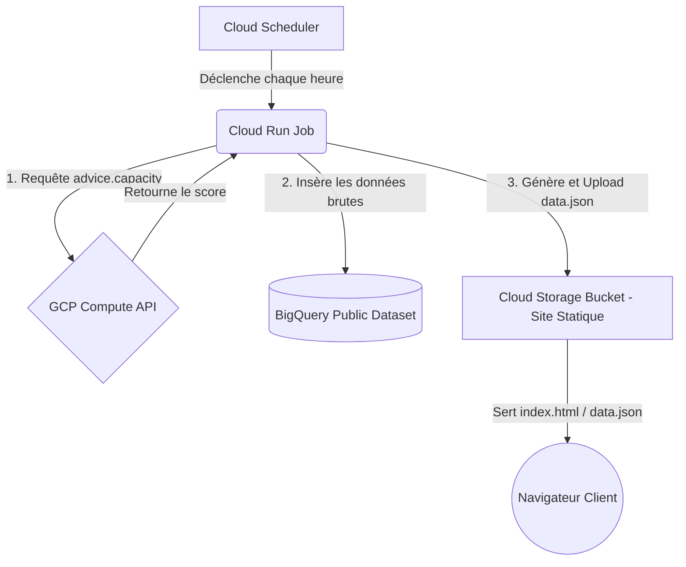

# GCP Spot VM Capacity Tracker 📊

Ce projet est un tableau de bord open source et entièrement "Google Native" permettant de suivre et de visualiser l'historique et la disponibilité de la capacité des VM Spot sur Google Cloud Platform (GCP).

L'architecture est optimisée pour être **100% serverless** et **maximum statique**, minimisant ainsi les coûts opérationnels et de maintenance.

---

## 🏗️ Architecture



1. **Collecte (Ingestion)** : Un script Python exécuté via un job Cloud Run toutes les heures (déclenché par Cloud Scheduler) interroge l'API GCP `advice.capacity`.
2. **Stockage & Historisation** : Les métriques de disponibilité sont insérées dans une table BigQuery partitionnée par jour et clustérisée. Ce dataset est configuré pour être public.
3. **Publication Statique** : Le même job Cloud Run compile les 30 derniers jours de données sous forme de fichier JSON (`data.json`) et l'écrit directement dans un bucket Google Cloud Storage (GCS).
4. **Visualisation (Frontend)** : Le frontend est un site statique hébergé sur GCS (HTML5/Vanilla CSS/JavaScript) qui consomme directement le fichier `data.json` pour afficher un graphique interactif (utilisant Chart.js).

---

## 📂 Structure du Projet

```text
├── Makefile                # Raccourcis de déploiement et d'exécution locale
├── README.md               # Guide d'utilisation
├── .env.example            # Template de configuration
├── fetcher/                # Le script d'ingestion (Python)
│   ├── Dockerfile
│   ├── requirements.txt
│   ├── main.py             # Script principal orchestrateur
│   ├── config.py           # Chargement des variables
│   ├── api_client.py       # Client Compute API avec backoff retry
│   ├── bigquery_writer.py  # Écriture dans BigQuery
│   └── gcs_exporter.py     # Requête SQL + génération de data.json
├── frontend/               # L'interface utilisateur statique
│   ├── index.html
│   ├── style.css           # Thème sombre GCP et responsive
│   ├── app.js              # Gestion de Chart.js et filtres UI
│   ├── data.mock.json      # Données de test pour le dev local
│   └── 404.html
├── infra/                  # Scripts de déploiement de l'infrastructure
│   ├── setup.sh            # Script d'orchestration global
│   ├── iam.sh              # Configuration IAM du service account
│   ├── bigquery.sh         # Dataset et table partitionnée/clustérisée
│   ├── gcs.sh              # Bucket de site statique public et CORS
│   └── scheduler.sh        # Configuration du Cloud Scheduler
├── sql/                    # Requêtes SQL de référence
│   ├── aggregate_history.sql
│   └── validate_schema.sql
└── scripts/
    └── deploy_frontend.sh  # Script de déploiement du frontend
```

---

## 🚀 Guide de Déploiement

### Prérequis
- Avoir la [gcloud CLI](https://cloud.google.com/sdk/gcloud) installée et configurée.
- Avoir un projet GCP actif.
- Avoir activé la facturation sur le projet (nécessaire pour Cloud Scheduler et BigQuery).

### Étape 1 : Configuration
Copiez le fichier d'exemple `.env.example` et complétez-le :
```bash
cp .env.example .env
```
Éditez `.env` et remplacez `mon-projet-gcp` par l'ID réel de votre projet GCP.

### Étape 2 : Déploiement de l'infrastructure via Terraform
Cette étape initialise et applique la configuration Terraform (située dans `infra/`) pour créer de manière déclarative et sécurisée l'ensemble des ressources nécessaires (Bucket GCS statique public, Dataset/Table BigQuery, Artifact Registry, Comptes de service et Cloud Scheduler).
```bash
make setup-infra
```

### Étape 3 : Déploiement du Frontend statique
Synchronisez l'interface utilisateur sur le bucket GCS :
```bash
make deploy-frontend
```
*Note : Le site chargera initialement le fichier de données simulées `data.mock.json` car aucune donnée n'a encore été collectée.*

### Étape 3.5 : Configuration du Nom de Domaine (DNS)

Pour rendre le site accessible via vos noms de domaine personnalisés, vous devez configurer les enregistrements DNS suivants chez votre fournisseur de domaine (Registrar) selon l'environnement déployé :

#### 🔹 Environnement de Non-Production (noprod)
- **Domaine cible** : `spotwatcher-noprod.kapable.info`
- **Enregistrement DNS** :
  | Type | Hôte / Nom | Cible / Valeur |
  | :--- | :--- | :--- |
  | `CNAME` | `spotwatcher-noprod` | `c.storage.googleapis.com.` |

#### 🔸 Environnement de Production (prod)
- **Domaine cible** : `spotwatcher.kapable.info`
- **Enregistrement DNS** :
  | Type | Hôte / Nom | Cible / Valeur |
  | :--- | :--- | :--- |
  | `CNAME` | `spotwatcher` | `c.storage.googleapis.com.` |

> [!WARNING]
> **Important - Limitations HTTPS** : L'hébergement natif de domaine personnalisé sur Cloud Storage ne supporte **que le protocole HTTP** par défaut.
> Si vous souhaitez activer le HTTPS (recommandé) :
> 1. Utilisez un proxy/CDN externe tel que **Cloudflare** (avec le SSL configuré en mode Flexible ou Complet).
> 2. Ou déployez un **Load Balancer HTTPS GCP** devant votre bucket Cloud Storage en y associant un certificat SSL géré par Google.


### Étape 4 : Déploiement du Job de Collecte (Fetcher)
1. Assurez-vous d'avoir créé un dépôt Docker dans Artifact Registry (nommé `spot-capacity-repo` dans la région définie).
2. Soumettez le build à Cloud Build :
```bash
make deploy-fetcher
```
Cette commande va compiler l'image Docker du fetcher, la pousser dans le registre et déployer/mettre à jour le Cloud Run Job.

---

## 🛠️ Développement Local

Vous pouvez tester le frontend localement très simplement sans aucun build step :
```bash
# Lancer un serveur web local dans le dossier frontend
cd frontend
python3 -m http.server 8080
```
Ouvrez ensuite [http://localhost:8080](http://localhost:8080).

Pour exécuter le script de collecte localement avec vos identifiants personnels (assurez-vous d'avoir fait `gcloud auth application-default login` au préalable) :
```bash
make run-local
```
