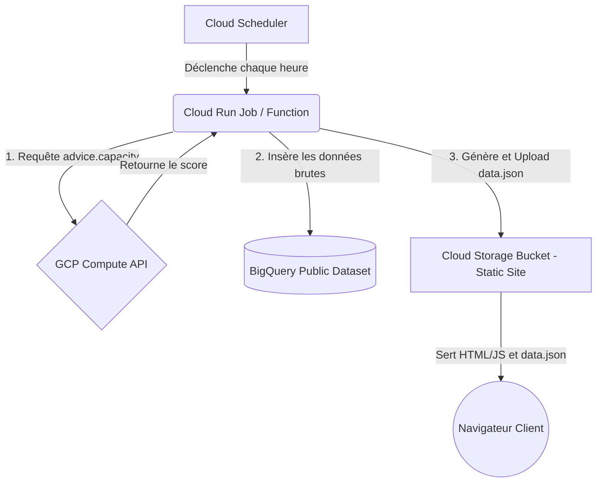

# Spécifications Techniques : Visualisateur de Capacité GCP

## Objectif
Créer un site web statique permettant de visualiser l'évolution temporelle de la capacité (disponibilité) des machines virtuelles (VM Spot) sur Google Cloud Platform (GCP).

## Principes d'Architecture (Maximum Static & Google Native)
Afin de respecter la contrainte "maximum static" tout en privilégiant les technologies Google, l'architecture repose sur des services managés et "serverless" pour la collecte, et un hébergement purement statique pour l'affichage.

### Composants Principaux
1. **Collecte de données (Data Ingestion)**
   - **Cloud Scheduler** : Déclenche un processus à intervalle régulier (ex: toutes les heures).
   - **Cloud Run (ou Cloud Run Functions)** : Exécute un script (Python/Go) qui interroge l'API GCP `advice.capacity` pour récupérer les scores de disponibilité (0.0 à 1.0) de certains types de machines dans plusieurs régions.
2. **Stockage & Historisation (Data Storage)**
   - **BigQuery** : Le script de collecte insère les données récupérées dans une table BigQuery. Le dataset BigQuery peut être rendu public (`public data set`) pour permettre à d'autres de l'explorer.
   - **Cloud Storage (GCS) - Export** : Pour alimenter le site statique sans nécessiter d'authentification ni de backend actif (API), le script de collecte génère un fichier agrégé (ex: `data.json` ou `latest_capacity.json`) et l'écrase dans le bucket GCS d'hébergement.
3. **Affichage (Frontend)**
   - **Cloud Storage (Website hosting)** : Un bucket GCS configuré pour héberger un site web statique.
   - **Site Statique (HTML/JS/CSS)** : Une page simple qui récupère le fichier `data.json` hébergé sur le même bucket et trace un graphique d'évolution temporelle à l'aide d'une librairie (comme Google Charts ou Chart.js).

## Schéma Conceptuel

